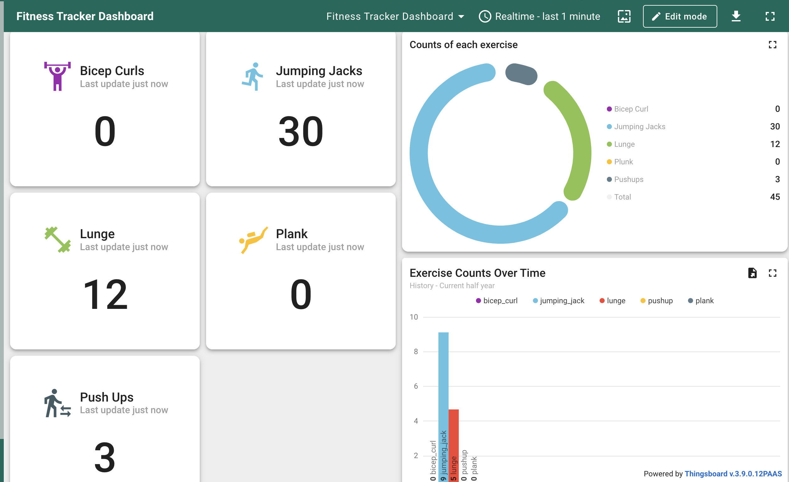
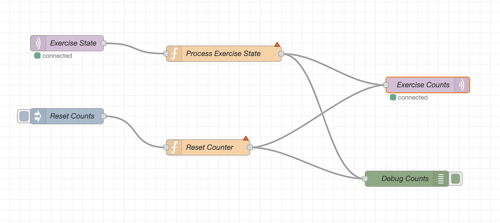
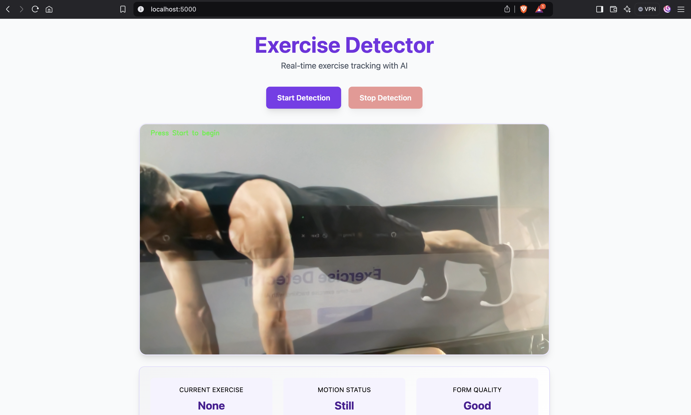

# 🏋️‍♂️ AI-Powered Fitness Tracker


A real-time exercise tracking system that uses computer vision and deep learning to detect and count various exercises. Built with TensorFlow, Flask, and MQTT for IoT integration.

## 🎯 Features

- **Real-time Exercise Detection**: Uses MobileNetV2 for efficient, accurate exercise classification
- **Motion Analysis**: Tracks user movement and provides feedback on form
- **Exercise Counting**: Automatically counts repetitions for supported exercises
- **IoT Integration**: MQTT protocol for real-time data transmission
- **Web Dashboard**: Interactive interface for exercise monitoring

## 📊 Dashboard Preview



The dashboard provides real-time statistics and exercise counts, including:
- Individual exercise counters
- Pie chart showing exercise distribution
- Historical exercise data
- Motion status monitoring
- Form quality feedback

## 🏗 Architecture

### Node Red Flow


he system utilizes Node-RED for real-time exercise state processing and counting. Here's how the flow works:

1. **Exercise State Input (MQTT)**
   - Subscribes to `fitness/exercise_state` topic
   - QoS level 1 for reliable message delivery
   - Receives JSON payloads with exercise state and motion data

2. **State Processing (Function Node)**
   - Tracks previous and current exercise states
   - Implements rep counting logic based on motion transitions
   - Maintains exercise counts in flow context
   - Exercise types: jumping_jack, bicep_curl, plank, lunge, pushup

3. **Data Publishing**
   - Sends exercise counts to ThingsBoard via MQTT
   - Topic: `v1/devices/me/telemetry`
   - Includes timestamp and individual exercise counts

4. **Reset Functionality**
   - Manual reset capability via inject node
   - Resets all exercise counters to zero
   - Broadcasts reset event to ThingsBoard

### Flow Configuration
```json
{
  "mqtt_broker": {
    "local": {
      "url": "localhost",
      "port": 1883,
      "protocol": "mqtt"
    },
    "thingsboard": {
      "url": "mqtt.thingsboard.cloud",
      "port": 1883,
      "protocol": "mqtt"
    }
  }
}
```

### Web Interface


The web interface features:
- Live video feed with exercise detection
- Start/Stop detection controls
- Real-time exercise status
- Motion status indicator
- Form quality feedback

## 🚀 Getting Started

### Prerequisites
```bash
python 3.8+
tensorflow
opencv-python
flask
paho-mqtt
```

### Installation

1. Clone the repository
```bash
git clone https://github.com/zachary013/fitness-tracker-model.git
cd fitness-tracker-ai
```

2. Install dependencies
```bash
pip install -r requirements.txt
```

3. Configure MQTT settings
```bash
cp mqtt_config.example.py mqtt_config.py
# Edit mqtt_config.py with your broker details
```

4. Run the application
```bash
python app.py
```

## 💪 Supported Exercises

- 🏃‍♂️ Jumping Jacks
- 💪 Bicep Curls
- 🧘‍♂️ Plank
- 🏋️‍♀️ Lunges
- 👊 Push-ups

## 🛠 Technical Details

### Model Architecture
- Base: MobileNetV2 (pre-trained on ImageNet)
- Custom top layers for exercise classification
- Transfer learning with fine-tuning
- Input shape: 224x224x3
- Output: 5 exercise classes

### Real-time Processing
- Motion detection using frame differencing
- Confidence threshold: 0.7
- MQTT QoS level: 1
- Frame processing at 30 FPS

## 🔄 MQTT Topics

- `exercise/state`: Current exercise state
- `exercise/counts`: Exercise repetition counts
- `exercise/debug`: System diagnostics

## 👥 Team

| Avatar                                                                                                  | Name | Role | GitHub |
|---------------------------------------------------------------------------------------------------------|------|------|--------|
|         | Zakariae Azarkan | WebCam Object Detection | [@zachary013](https://github.com/zachary013) |
|           | Salaheddine El Jably | Model Training | [@Sam-Jab](https://github.com/Sam-Jab) |

## 🤝 Contributing

Contributions are welcome! Please feel free to submit a Pull Request.

## 📝 License

This project is licensed under the MIT License - see the [LICENSE](LICENSE) file for details.

## 🙏 Acknowledgments

- TensorFlow team for MobileNetV2
- Flask development team
- OpenCV contributors
- Eclipse Mosquitto MQTT broker team

---
Made with ❤️ for IoT and Fitness